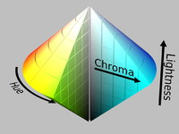

# References 
- https://nalinc.github.io/blog/2018/skin-detection-python-opencv/
- https://github.com/CHEREF-Mehdi/SkinDetection
- https://github.com/JamieMagee/skin-detect/blob/master/src/skin-detect.cpp

---

~~# Grayscale Detection Approaches:~~
~~- [ ] **Skin Color Segmentation**: Learn to detect and segment the hand based on skin color using color spaces like HSV or YCrCb.~~

~~- [ ] **Background Subtraction:** Use background subtraction techniques to isolate moving objects (like hands) in a grayscale video. This method focuses on detecting changes in the scene rather than identifying specific colors.~~

~~- [ ] **Edge Detection:** Apply edge detection methods (e.g., Canny edge detection) to identify the contours of a hand in a grayscale image. This can be effective for gesture recognition, especially if the background is relatively uniform.~~

~~- [ ] **Optical Flow:** Use optical flow methods to track the movement of pixels between frames in a video sequence. This can be used to detect hand movements in grayscale images without relying on color information.~~

~~- [ ] **Shape and Contour Analysis:** After detecting motion, analyze the shape and contours of the moving object to differentiate between a hand and other objects.~~

~~### Performance Considerations on Raspberry Pi:~~
~~- [ ] **Grayscale Processing:** Grayscale images require less computational power than color images, which is beneficial on a Raspberry Pi. The reduced data size also speeds up processing.~~

~~- [ ] **Trade-offs:** While you lose the ability to detect skin tones directly, the faster processing might allow for real-time gesture recognition, especially if combined with other features like motion tracking.~~

---

# HSV Versus YCrCb
 
## [HSV](https://www.geeksforgeeks.org/hsv-color-model-in-computer-graphics/) 

### What is HSV?
- Most accurate way humans perceive color
- `H` stands for : `Hue`
  - Tells the angle to look at the cylindrical disk in the screenshot below
  - Hue represents `color` 
  - Ranges from `0 - 360 degrees`
  - 
- `S` stands for : `Saturation`
  - Tells us how much `quantity` of a respective color must be added
  - 100% means that complete pure color is added
  - 0% means no color is added
    - Results in `grayscale image` 
- `V` stands for : `value`
  - Represents the `brightness` when it comes to the `saturdation` of a color
  - `0` represents total black
  - `100` represents `full brightness`

### Advantages
- HSV generalizes how humans perceive color
- Most accurate depiction of how we 'feel' colors on the computer screen
- The HSV color space also separates the `luma` from the `color information`
  - This lets us perform operations mentioned in the `application` section below

### Imagine a cone
- That has a spectrum of:
  - Red to blue from left --> right
  - Also from the center to the  edge the color intensity increases
  - From bottom to top
    - Brightness increases 
  - Hence the white at the top
- Chroma 
  - Purity/intensity of a color in relation to gray
  - Represents how vivid/saturated a color appears 
    - Higher the chroma, the more intense the color
    

### Applications
- HSV model used for histogram equalization
- Converting `grayscale` to `RGB`

## YCrCb

### What is it
- Color space that's mostly used in video/image compression
  - Like in JPEG images and video formats like MPEG
- Both the `luminance` and `chrominance` components are seperated 
  - Makes it more efficient for compression/processing
  - Since we can reduce the resolution of both `Cr` and `Cb` channels since the human eye is less sensitive to color differences versus brightness
    - This leads to reducting the amount of data w/o affecting the perceived image quality
- Below is what each component standss for 
  - `Y` (Luminance): 
    - This brightness or intensity of the color
    - Similar to a grayscale version of the image
    - Determines how light or dark a color appears.
  - `Cr` (Chrominance-Red): 
    - Represents the difference between the `red component` and the `luminance`. 
    - Adds the `red` color information to the image.
  - `Cb` (Chrominance-Blue): 
    - Represents the difference between the `blue component` and the `luminance`
    - Adds the `blue` color information to the image.

---

# [Human Skin Detection Using RGB, HSV and YCbCr Color Models Paper](https://arxiv.org/abs/1708.02694)

## Abstract
### Big idea
- New skin detection algorithm proposed in this paper
- Three main parameters for recognizing skin pixel
  - RGB
  - HSV
  - YCbCr 
- Objective of proposed algorithm
  - Improve recognitition of skin pixels in given image
  - Algorithm not only considers individual ranges of the three color parameters
    - But also takes into account the combinational ranges that provide greater accuracy in recognizing the skin area in a given image

## Intro 
### Primary key for skin recognition from an image is skin color but color can't be the only deciding factor due to variations in skin tone
- Other factors like `lighting conditions` also affect the results
- Therefore skin tone is often combined with other cues like `texture` and `edge features`
  - To accomplish this
    - Must break down image into `individual pixels`
    - Classify them as `skin colored` and `non-skin colored`
  - One simple method
    - Check if each skin pixel falls into a `defined color range` or `values` in some coordinates of a color space
    - There's a ton of color spaces that are used for skin color segmentation
      - RGB 
      - HSV
      - YCbCr
      - YIQ
      - YUV
      - Etc...
- New threshold based on combination of `RGB` `HSV` and `YCbCr` values
- Following factors should be considered for determining `threshold range`
  - 1) Effect of `illumination` depending on the surroundings.
    1) `Individual characteristics` such as age, sex and body parts.
    1) Varying skin tone with respect to different races.
    2) Other factors such as `background colors`, `shadows` and `motion blur`.
- Skin detection influenced by parameters like
  - Brightness
  - Contrast
  - Transparency
  - Illumination
  - Saturation
- Detection normally optimized by taking all of the mentioned points into consideration in their ideal ranges

## Literature review
### This paper uses `threshold based methodology` 
- To detect if an image is a skin image or not
- Attempts to give a constructive/fesible solution to skin disease detection problem by `implementing different color models` on the skin image
  - It formulates a range for `RGB`, `HSV` and `YcCr` models
  - These ranges try to distinguish `skin pixels` from `non-skin pixels`
- After comparative study of streghts/weaknesses of these models
  - Combination of `RGB`, `HSV` and `YCbCr` seems to do the job when recognizing skin images


## Proposed Skin Detection Algorithm
### Converts entire image into 2D matrix
- Columns/row size defined by width/height of the image respectively
- Once image is divided 
  - Each entry consists of a pixel of the image
  - The Alpha/Red/Green/Blue (ARGB) color of that particular pixel is determined 
  - The ARGB value retrieved from each pixel is a `32-bit` value
  - To extract ARGB values
    - Right shift the value by `24 bit` to get the `alpha` value
    - Alpha value normally opacity channel 
      - If pixel has 0% opacity it's fully transparent 
      - While if a pixel has 100%, it's fully opaque 
    - The same bit shifting is the same for red at `16 bits` and green at `8 bits`
    - The remaining color is just blue
### Bitwise `AND` operation with `0xff` was applied to all the calculated values to extract only the bits that corresponded to that particular color
  - This was applied to each/every pixel in the image
  - To make the recognition more precise
    - ARGB value converted to HSV 
    - Same goes for the YCbCr value using 
      - Conversion factors 
      - Built-in function 
- The `HSV`, `YCbCr` and `ARGB` value of each pixel
  - Is compared to the standard values of a `skin pixel` 
  - Then decides if the pixel is a skin pixel or not depending on the values that lie in a range of `predefined threshold values` for each parameter

### Ranges for a skin pixel in different color spaces used by algorithm is as followed 

```sh
(H : Hue ; S: Saturation ; R : Red ; B: Blue ; G : Green ; Cr, Cb : Chrominance components ; Y : luminance
component ) Figure 4 below shows flowchart that illustrates steps of the algorithm.

0.0 <= H <= 50.0 and 0.23 <= S <= 0.68 and
R > 95 and G > 40 and B > 20 and R > G and R > B
and | R - G | > 15 and A > 15

OR
R > 95 and G > 40 and B > 20 and R > G and R > B
and | R - G | > 15 and A > 15 and Cr > 135 and
Cb > 85 and Y > 80 and Cr <= (1.5862*Cb)+20 and
Cr>=(0.3448*Cb)+76.2069 and
Cr >= (-4.5652*Cb)+234.5652 and
Cr <= (-1.15*Cb)+301.75 and
Cr <= (-2.2857*Cb)+432.85nothing
```


## Experimental Results 
### Pratheepan dataset for human skin detection
- Used as baseline for comparing results 
- Images in dataset were randomly downloaded from Google
  - Images cpatured with range of different cameras 
  - Using 
    - Different color enchancements
    - Different illuminations
- Dataset also has `Ground truth` images for sample images in dataset
- `Figure 5` shows results obtained from some of the images in the dataset
  - Each diagram shows
    - Original image
    -  Ground truth image
    -  Resultant image from proposed algoirthm
### Table 1
- Shows accuracy calculations on images shown in `figure 5` using the following definitions 
  - True positive (TP)
    - Shows accuracy calculations on the images show in `figure 5` using the following definitions
      - True positive : TP
        - Number of skin pixels correctly ID as skin
      - True negative : TN
        - Number of non-skin pixels correctly ID as non-skin
      - False positive : FP 
        - Non-skin pixel incorrectly ID as skin
      - False negative : FN
        - Skin pixel incorrectly ID as non-skin
- Precision/accuracy calculated using equations 7 and 8 respectively 
  - 
  - 

## Conclusion
- The proposed algorithm is capable of processing images in different lightin conditions 
- Things seem promising in terms of precision and accuracy when comapred to baseline