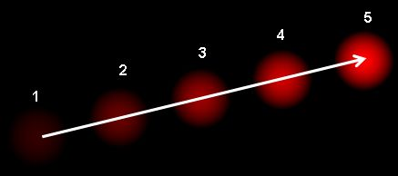

# OpenCV Notes

## Definition of Optical Flow
- Pattern of apparent motion in image objects between two consecutive frames caused by `movement of the object` or `camera`
- Consider the image below 


- Shows ball moving in 5 consecutive frames 
- Arrow shows displacement vector

## Optical flow has numerous applications in areas like
- Structure from Motion
- Video compression
- Video stabilization

## Optical flow works on several assumptions
- Pixel intensities of an object don't change between consecutive frames
- Neighbouring pixels have similar motion

## Lucas-Kanade Method
- Takes a 3x3 patch around the point so all 9 points will have the same motion
  - We can then find `fx` `fy` `ft` for those 9 points 
  - So our problem becomes `solving 9 equations` with `two unknown variables` which is over-determined
  - Better solution is obtained with `least square fit method`
  - Below is the final solution which two equation-two unknown problem and to get the solution

## From the user's POV
- Idea is simple
  - Get some points to track
  - Get the optical flow vectors of those points 
  - But there are some issues 
    - Small motions are `removed`
    - Large motions become `small motions`
    - So by applying `Lucas_kanade` we get optical flow along `with the scale`


# Applying adaptive thresholding won't help much with optical flow
- Optical flow computes `motion vectors between frames` which are already numerical representations of movement
- While adaptive thresholding operates on `pixel intensity values`
  - Thus making it irrelevant to the motion vectors

# Situations where thresholding could help with optical flow

## Motion masking (COME BACK TO THIS)
- Use adaptive thresholding to `segment regions of interest` (e.g., the hand) and `create a mask`.
- Apply optical flow `only within the masked regions`, focusing on hand movement while ignoring the background.
- Benefit: `Reduces computational load` and `improves motion tracking accuracy` by isolating the moving object.

## Post-Processing Flow Field:

- After calculating optical flow, you can apply thresholding (not necessarily adaptive) to filter out small, insignificant motion vectors caused by noise or minor pixel shifts.
- Benefit: Simplifies motion patterns and focuses on meaningful gestures.

## Hybrid Approaches:

- Combine adaptive thresholding with motion detection to enhance robustness under varying lighting conditions. For example:
  - Adaptive thresholding isolates the hand region.
  - Optical flow tracks movement within that region.


# Optical Flow for Motion Gesture Recognition : LLM Generated Response
=====================================================

## Overview

Optical flow provides valuable insights into motion patterns, direction, 
and velocity of movement in hand gesture recognition, especially when 
gestures involve motion.

## Key Concepts of Optical Flow

### Definition

Optical flow refers to the apparent motion of brightness patterns in an 
image sequence, where pixel intensities are tracked to determine motion.

### Motion Vectors

For each pixel, optical flow calculates a motion vector that indicates the 
direction and magnitude of movement from one frame to the next.

## Applications in Gesture Recognition

By tracking the movement of the hand, optical flow can help classify 
dynamic gestures that involve motion.

## Common Optical Flow Methods

### Lucas-Kanade Optical Flow

*   **Description:** This algorithm assumes that nearby pixels have 
similar motion and that motion between frames is small. It calculates the 
flow for sparse points in the image, which is efficient and accurate for 
slower, localized movements.
*   **Typical Use:** Good for tracking specific points of interest (like 
hand landmarks) in real-time.
*   **Implementation:** In OpenCV, `cv::calcOpticalFlowPyrLK()` provides 
an efficient implementation.

### Farneback Optical Flow

*   **Description:** Farneback is a dense optical flow method that 
estimates motion for every pixel, resulting in a more detailed flow field 
than Lucas-Kanade.
*   **Typical Use:** Suitable for detecting broader and faster gestures as 
it covers the entire image, though it is computationally heavier.
*   **Implementation:** In OpenCV, `cv::calcOpticalFlowFarneback()` can be 
used for dense flow calculation.

### SimpleFlow and DeepFlow

*   **SimpleFlow:** A high-level method that provides a balance between 
accuracy and efficiency.
*   **DeepFlow:** Uses deep learning techniques to estimate optical flow, 
which can lead to better performance but also requires more computational 
resources.

## Benefits and Limitations

### Benefits:

*   Captures real-time motion dynamics.
*   Enhances gesture recognition accuracy by adding motion-based data.
*   Works well for tracking distinct movements, like swipes or hand waves.

### Limitations:

*   Sensitive to noise and lighting changes.
*   Computationally intensive (especially dense optical flow).
*   Requires careful tuning of parameters to avoid false motion detection 
in complex backgrounds.

## Example: Lucas-Kanade Optical Flow in OpenCV (C++)

```cpp
#include <opencv2/opencv.hpp>
#include <iostream>
#include <vector>

int main() {
    cv::VideoCapture cap(0); // Capture video from the webcam
    if (!cap.isOpened()) {
        std::cerr << "Error: Could not open video capture." << std::endl;
        return -1;
    }

    cv::Mat prevGray, gray, frame;
    std::vector<cv::Point2f> prevPoints, currPoints;

    // Capture the first frame to initialize previous points
    cap >> frame;
    cv::cvtColor(frame, prevGray, cv::COLOR_BGR2GRAY);

    // Detect initial features to track (e.g., corners or points on hand)
    cv::goodFeaturesToTrack(prevGray, prevPoints, 100, 0.3, 7);

    while (true) {
        cap >> frame;
        if (frame.empty()) break;

        // Convert to grayscale
        cv::cvtColor(frame, gray, cv::COLOR_BGR2GRAY);

        // Calculate optical flow
        std::vector<uchar> status;
        std::vector<float> err;
        cv::calcOpticalFlowPyrLK(prevGray, gray, prevPoints, currPoints, 
status, err);

        // Draw the motion vectors
        for (size_t i = 0; i < currPoints.size(); i++) {
            if (status[i]) {
                cv::line(frame, prevPoints[i], currPoints[i], 
cv::Scalar(0, 255, 0), 2);
                cv::circle(frame, currPoints[i], 5, cv::Scalar(0, 0, 255), 
-1);
            }
        }

        // Display result
        cv::imshow("Optical Flow - Lucas-Kanade", frame);

        // Update for next frame
        prevGray = gray.clone();
        prevPoints = currPoints;

        if (cv::waitKey(30) == 'q') break;
    }

    cap.release();
    cv::destroyAllWindows();
    return 0;
}
```

This code snippet uses Lucas-Kanade optical flow to track the movement of 
a hand in real-time. The `cv::calcOpticalFlowPyrLK()` function is used to 
calculate the motion vectors, and the results are displayed on the video 
frame.

## Tips for Using Optical Flow Effectively

*   Balance between accuracy and efficiency: Experiment with different 
parameters to find the optimal balance for your specific application.
*   Reduce search area: By reducing the search area, you can reduce 
computational intensity and improve performance.
*   Combine with other segmentation techniques: Consider combining optical 
flow with other segmentation techniques like color thresholding or 
background subtraction to improve accuracy.
